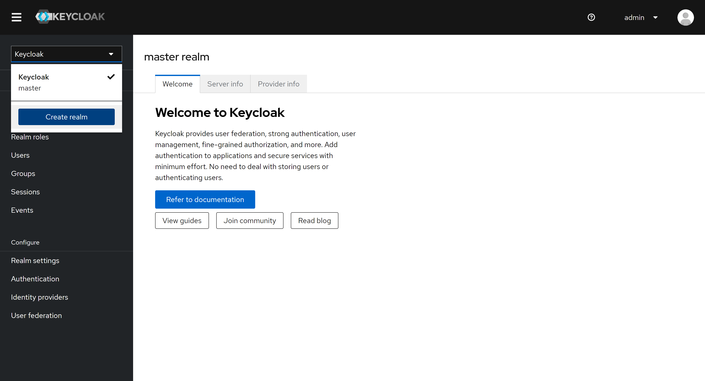
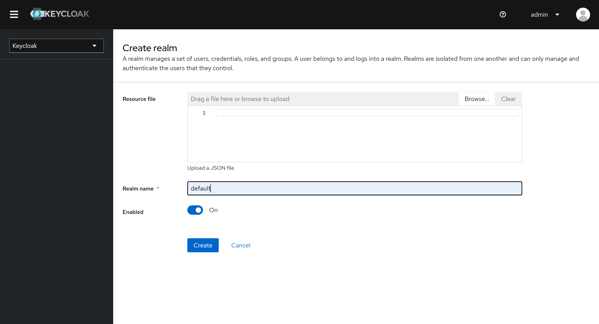
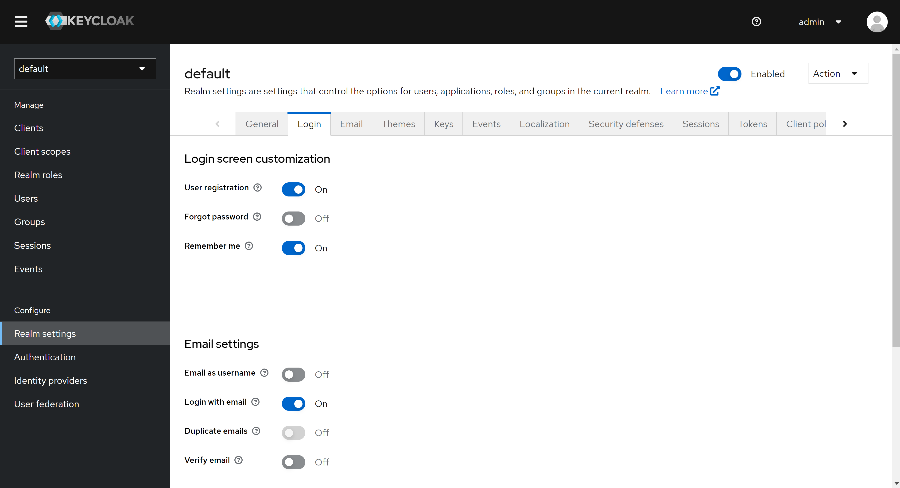
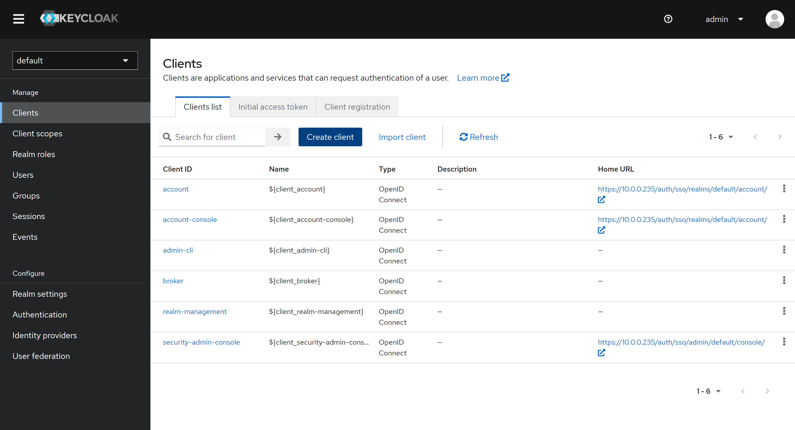
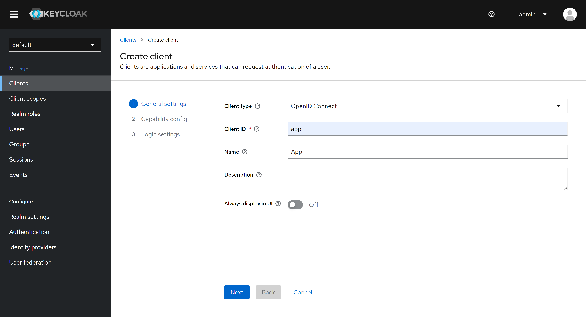
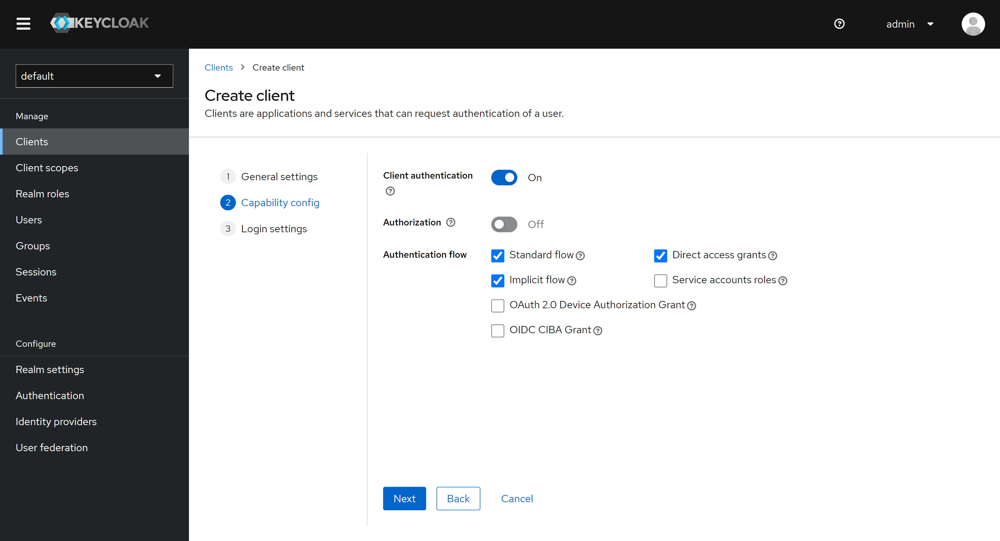
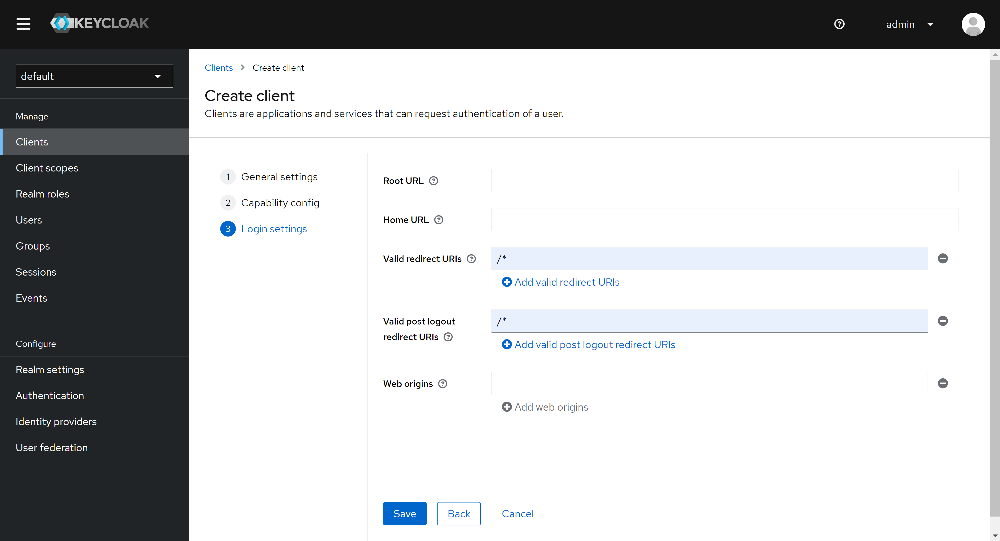
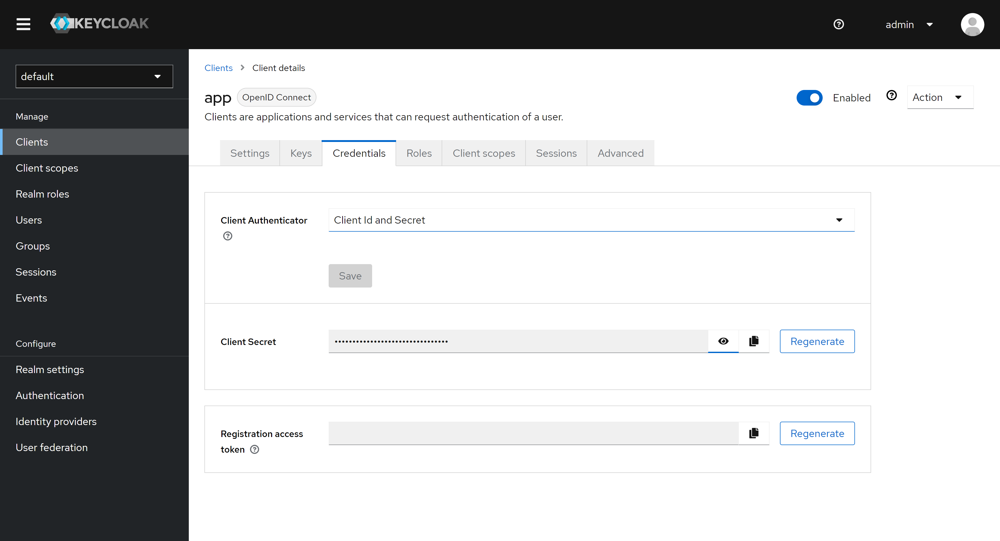

<p align="center">
  <a href="http://pnnl.gov" target="blank"></a>
</p>

<h1 align="center">Skeleton App</h1>

<p align="center">
  <strong>A full-stack TypeScript web application framework for PNNL developers</strong>
</p>

<p align="center">
  <a href="https://tanuki.pnnl.gov/amelia.bleeker/skeleton" target="_blank">
    
  </a>
  <a href="https://tanuki.pnnl.gov/amelia.bleeker/skeleton" target="_blank">
    
  </a>
  <a href="./LICENSE.txt" target="_blank">
    
  </a>
  <a href="https://nodejs.org/dist/latest-v22.x/" target="_blank">
    
  </a>
  <a href="https://yarnpkg.com/getting-started/install" target="_blank">
    
  </a>
  <a href="mailto:amelia.bleeker@pnnl.gov">
    
  </a>
</p>

---

## Table of Contents

- [🚀 Features](#-features)
- [🏗️ Architecture](#️-architecture)
- [🚀 Getting Started](#-getting-started)
  - [Quick Start (Docker - Recommended)](#quick-start-docker---recommended)
  - [Development Setup](#development-setup)
  - [First Steps](#first-steps)
- [📚 API Documentation](#-api-documentation)
  - [GraphQL API](#graphql-api)
  - [REST API](#rest-api)
  - [Authentication](#authentication)
- [🔒 Security](#-security)
  - [Authentication & Authorization](#authentication--authorization)
  - [Security Headers](#security-headers)
  - [Data Protection](#data-protection)
- [🛠️ Troubleshooting](#️-troubleshooting)
  - [Debugging](#debugging)
- [📈 Performance](#-performance)
  - [Optimization Guidelines](#optimization-guidelines)
  - [Monitoring](#monitoring)
- [Prerequisites](#prerequisites)
- [Deployment](#deployment)
  - [Traefik Reverse Proxy (optional)](#traefik-reverse-proxy-optional)
  - [Bookstack Wiki (optional)](#bookstack-wiki-optional)
  - [Keycloak Authentication (optional)](#keycloak-authentication-optional)
  - [Nominatim (optional)](#nominatim-optional)
  - [Open Street Map Tiles (optional)](#open-street-map-tiles-optional)
  - [Configuration](#configuration)
  - [TLS (SSL/HTTPS)](#tls-sslhttps)
  - [Docker Compose](#docker-compose)
  - [Setup Keycloak](#setup-keycloak)
  - [Administration](#administration)
  - [Utilities](#utilities)
- [Development](#development)
  - [Node.js](#nodejs)
  - [Project Structure](#project-structure)
  - [Installing and Initializing the Skeleton App](#installing-and-initializing-the-skeleton-app)
  - [Compiling](#compiling)
  - [Quality](#quality)
  - [Initializing](#initializing)
  - [Running](#running)
  - [Configuration](#configuration-1)
- [Contributing](#contributing)
  - [Development Workflow](#development-workflow)
  - [Coding Standards](#coding-standards)
  - [Testing Requirements](#testing-requirements)
  - [Code Review Process](#code-review-process)
  - [Reporting Issues](#reporting-issues)
  - [Security Issues](#security-issues)
- [Developing Towards the Skeleton Project](#developing-towards-the-skeleton-project)
  - [Branches](#branches)
  - [Workflow](#workflow)
- [License](#license)
  - [Copyright Notice](#copyright-notice)
  - [Usage Rights](#usage-rights)
  - [Restrictions](#restrictions)
  - [Contact Information](#contact-information)
  - [Third-party Dependencies](#third-party-dependencies)

---

## 🚀 Features

- **🏗️ Modern Architecture**: Full-stack TypeScript with Next.js frontend and NestJS backend
- **🔐 Flexible Authentication**: Support for Auth.js, Passport, local auth, SSO (Keycloak), and bearer tokens
- **📊 GraphQL API**: Type-safe API with Apollo Client/Server and real-time subscriptions
- **🗄️ Database Integration**: PostgreSQL with PostGIS for geospatial data and Prisma ORM
- **🐳 Container Ready**: Docker Compose deployment with optional services
- **🌍 Geospatial Support**: Built-in mapping with MapLibre GL and OpenStreetMap tiles
- **🔒 Security First**: TLS/SSL support, role-based access control, and secure session management
- **📈 Scalable**: Redis caching, GraphQL subscriptions, and horizontal scaling support
- **🛠️ Developer Experience**: Hot reload, type safety, automated testing, and comprehensive tooling

## 🏗️ Architecture

The Skeleton App is built on a modern, scalable architecture:

### Core Stack

- **Frontend**: Next.js 14+ with React 18, TypeScript, and SCSS
- **Backend**: NestJS with Express, TypeScript, and modular architecture
- **Database**: PostgreSQL 16+ with PostGIS 3+ for geospatial data
- **ORM**: Prisma with type-safe database access and migrations
- **API**: GraphQL with Apollo Server/Client and Pothos for type safety
- **Authentication**: Auth.js (primary) with Passport.js fallback support
- **Caching**: Redis for sessions and GraphQL subscriptions
- **Deployment**: Docker Compose with multi-service orchestration

### Optional Services

- **Reverse Proxy**: Traefik with automatic TLS/SSL certificates
- **SSO**: Keycloak for enterprise authentication
- **Maps**: OpenStreetMap tiles with MapLibre GL
- **Geocoding**: Nominatim for address lookup and geocoding
- **Documentation**: BookStack wiki integration
- **Monitoring**: Built-in logging and health checks

### Key Features

- **Session Management**: JWT tokens or database session tracking
- **Real-time Updates**: GraphQL subscriptions with Redis pub/sub
- **Geospatial Queries**: PostGIS integration for location-based features
- **Role-based Security**: Granular permissions and access control
- **Multi-tenant Ready**: Configurable external service routing
- **Development Tools**: Hot reload, type checking, and automated testing
- **Type Safety**: End-to-End type safety

This guide supports Windows, Linux, and macOS installations.

---

## 🚀 Getting Started

Get up and running with the Skeleton App:

### Quick Start (Docker - Recommended)

1. **Clone the repository**

   ```bash
   git clone https://tanuki.pnnl.gov/amelia.bleeker/skeleton.git
   cd skeleton
   ```

2. **Configure environment**

   ```bash
   # Copy and customize environment files
   cp .env.example .env
   cp .env.secrets.example .env.secrets

   # Edit '.env' and set 'HOSTNAME' to a valid hostname or your IP Address

   # Set secrets (Windows)
   .\secrets.ps1

   # Set secrets (Linux/Mac)
   source ./secrets.sh
   ```

3. **Start the application**

   ```bash
   docker compose up -d
   ```

4. **Access the application**
   - Main app: https://localhost
   - GraphQL Playground: https://localhost/graphql
   - API docs: https://localhost/swagger

### Development Setup

1. **Install prerequisites**

   - Node.js 22.x
   - Yarn 4.x
   - PostgreSQL 16+ with PostGIS 3+

2. **Setup PostgreSQL Database**

   **Install PostgreSQL:**

   **Windows:**

   ```bash
   # Download and install from https://www.postgresql.org/download/windows/
   # Or use Chocolatey
   choco install postgresql
   ```

   **macOS:**

   ```bash
   # Using Homebrew
   brew install postgresql@16 postgis

   # Start PostgreSQL service
   brew services start postgresql@16
   ```

   **Linux (Ubuntu/Debian):**

   ```bash
   # Install PostgreSQL and PostGIS
   sudo apt update
   sudo apt install postgresql-16 postgresql-16-postgis-3 postgresql-contrib

   # Start PostgreSQL service
   sudo systemctl start postgresql
   sudo systemctl enable postgresql
   ```

   **Create Development User:**

   ```bash
   # Connect to PostgreSQL as superuser
   sudo -u postgres psql

   # Or on Windows/macOS (if postgres user doesn't exist)
   psql -U postgres
   ```

   **In the PostgreSQL prompt, create the develop user:**

   > Note: The database creation and postgis extension creation is optional and will be performed by the database migration.

   ```sql
   -- Create the develop user with required permissions
   CREATE USER develop WITH PASSWORD 'password';
   ALTER USER develop CREATEDB;
   ALTER USER develop WITH SUPERUSER;

   -- Create the skeleton database
   CREATE DATABASE skeleton OWNER develop;

   -- Connect to the skeleton database and enable PostGIS
   \c skeleton
   CREATE EXTENSION IF NOT EXISTS postgis;
   CREATE EXTENSION IF NOT EXISTS "uuid-ossp";

   -- Exit PostgreSQL prompt
   \q
   ```

   **Verify Database Setup:**

   ```bash
   # Test connection with develop user
   psql -U develop -d skeleton -h localhost

   # In PostgreSQL prompt, verify PostGIS installation
   SELECT PostGIS_Version();

   # Exit
   \q
   ```

3. **Build and run**

   ```bash
   # Build all modules
   ./build.sh  # or .\build.ps1 on Windows

   # Start development servers
   cd server && yarn start &
   cd client && yarn start
   ```

4. **Verify installation**
   - Frontend: http://localhost:3000
   - Backend: http://localhost:3001
   - GraphQL: http://localhost:3001/graphql

### First Steps

1. **Login as a test user** using credentials in [system-user.json](./docker/seed/20211103151730-system-user.json)
2. **Explore the GraphQL API** at `/graphql`
3. **Check the example components** in the client application
4. **Review the authentication flow** with different providers

---

## 📚 API Documentation

### GraphQL API

The application provides a comprehensive GraphQL API with the following features:

- **Endpoint**: `/graphql`
- **Playground**: Available in development mode
- **Schema**: Auto-generated from Pothos schema builders
- **Subscriptions**: Real-time updates via WebSocket
- **Authentication**: JWT tokens and session-based auth

#### Key Queries

```graphql
# Get current logged-in user
query ReadCurrent {
  readCurrent {
    id
    email
    name
    role
    image
    createdAt
    preferences
  }
}

# List users with pagination
query PageUsers($first: Int, $after: String) {
  pageUser(first: $first, after: $after) {
    edges {
      node {
        id
        email
        name
        role
        createdAt
      }
    }
    pageInfo {
      hasNextPage
      hasPreviousPage
      startCursor
      endCursor
    }
  }
}

# Read specific user by ID
query ReadUser($where: UserUniqueFilter!) {
  readUser(where: $where) {
    id
    email
    name
    role
    image
    emailVerified
    createdAt
    updatedAt
  }
}

# List comments with user information
query ReadComments($paging: PagingInput, $orderBy: [CommentOrderBy!]) {
  readComments(paging: $paging, orderBy: $orderBy) {
    id
    message
    createdAt
    user {
      id
      name
      email
    }
  }
}

# Get feedback with files and assignee
query ReadFeedbacks($where: FeedbackFilter) {
  readFeedbacks(where: $where) {
    id
    message
    status
    createdAt
    user {
      id
      name
      email
    }
    assignee {
      id
      name
      email
    }
    files {
      id
      objectKey
      mimeType
      contentLength
    }
  }
}

# Search geographies by area
query AreaGeographies($area: GeographyGeoJson!) {
  areaGeographies(area: $area) {
    id
    name
    type
    group
    geojson
  }
}
```

#### Key Mutations

```graphql
# Create a new user
mutation CreateUser($create: UserCreateInput!) {
  createUser(create: $create) {
    id
    email
    name
    role
    createdAt
  }
}

# Update current user profile
mutation UpdateCurrent($update: CurrentUpdateInput!) {
  updateCurrent(update: $update) {
    id
    email
    name
    image
    preferences
  }
}

# Create a comment
mutation CreateComment($create: CommentCreateInput!) {
  createComment(create: $create) {
    id
    message
    createdAt
    user {
      id
      name
    }
  }
}

# Create feedback
mutation CreateFeedback($create: FeedbackCreateInput) {
  createFeedback(create: $create) {
    id
    message
    status
    createdAt
    user {
      id
      name
      email
    }
  }
}

# Update feedback status
mutation UpdateFeedback($where: FeedbackUniqueFilter!, $update: FeedbackUpdateInput!) {
  updateFeedback(where: $where, update: $update) {
    id
    message
    status
    updatedAt
    assignee {
      id
      name
      email
    }
  }
}

# Create a banner
mutation CreateBanner($create: BannerCreateInput!) {
  createBanner(create: $create) {
    id
    message
    expiration
    createdAt
  }
}
```

#### Subscriptions

```graphql
# Real-time user updates
subscription ReadCurrentSubscription {
  readCurrent {
    id
    email
    name
    role
    updatedAt
  }
}

# Real-time comments updates
subscription ReadCommentsSubscription {
  readComments {
    id
    message
    createdAt
    user {
      id
      name
    }
  }
}

# Real-time feedback updates
subscription ReadFeedbacksSubscription($where: FeedbackFilter) {
  readFeedbacks(where: $where) {
    id
    message
    status
    updatedAt
    user {
      id
      name
    }
    assignee {
      id
      name
    }
  }
}

# Real-time banner updates
subscription ReadBannersSubscription {
  readBanners {
    id
    message
    expiration
    createdAt
  }
}

# Real-time log monitoring
subscription ReadLogsSubscription($where: LogFilter) {
  readLogs(where: $where) {
    id
    message
    type
    createdAt
  }
}
```

#### Example Variables

```json
{
  "create": {
    "email": "user@example.com",
    "name": "John Doe",
    "password": "securePassword123",
    "role": "user"
  },
  "where": {
    "id": "clx1234567890abcdef"
  },
  "update": {
    "name": "Jane Doe",
    "preferences": {
      "theme": "dark",
      "notifications": true
    }
  },
  "paging": {
    "skip": 0,
    "take": 10
  },
  "orderBy": [
    {
      "createdAt": "Desc"
    }
  ]
}
```

### REST API

Limited REST endpoints are available for specific use cases:

- **Authentication**: `/api/auth/*`
- **File uploads**: `/api/file/*`

### Authentication

The application supports multiple authentication methods:

#### Auth.js (Primary)

- **Local authentication**: Email/password
- **OAuth providers**: Configurable (Google, GitHub, etc.)
- **Session management**: JWT with database tracking

#### Keycloak SSO

- **Enterprise SSO**: OIDC/SAML integration
- **Role mapping**: Automatic role assignment
- **Multi-tenant**: Support for multiple realms

#### Bearer Tokens

- **API access**: JWT tokens for service-to-service
- **Scoped access**: Role-based permissions

---

## 🔒 Security

### Authentication & Authorization

- **Multi-factor authentication**: Configurable via Keycloak
- **Role-based access control**: Granular permissions system
- **Session management**: Secure session handling with Redis
- **Password policies**: Configurable strength requirements

### Security Headers

The application implements security best practices:

- **HTTPS enforcement**: TLS 1.2+ required
- **CORS protection**: Configurable origins
- **CSP headers**: Content Security Policy
- **Rate limiting**: API endpoint protection

### Data Protection

- **Encryption at rest**: Database encryption support
- **Encryption in transit**: TLS for all communications
- **Secrets management**: Environment-based configuration
- **Audit logging**: Comprehensive activity tracking

---

### Debugging

#### Enable Debug Logging

```bash
# Server debugging
LOG_CONSOLE_LEVEL=debug
LOG_DATABASE_LEVEL=debug

# Client debugging
NEXT_PUBLIC_DEBUG=true
```

#### Database Query Logging

```bash
# Enable Prisma query logging
LOG_PRISMA_LEVEL=info
```

---

## 📈 Performance

### Optimization Guidelines

#### Database

- **Connection pooling**: Configured via Prisma
- **Query optimization**: Use database indexes

#### Frontend

- **Code splitting**: Automatic with Next.js
- **Image optimization**: Built-in Next.js features
- **Static generation**: ISR for dynamic content

#### Backend

- **GraphQL caching**: Apollo Server cache
- **Database queries**: Efficient Prisma queries

### Monitoring

#### Health Checks

- **Application**: `/api/health`
- **Database**: Connection monitoring
- **Redis**: Cache availability

#### Metrics

- **Response times**: Built-in logging
- **Error rates**: Comprehensive error tracking
- **Resource usage**: Container monitoring

## Prerequisites

These applications should be installed on the host machine. The `development` tagged prerequisites are needed for local development only. The `deployment` tagged prerequisites are necessary for deployment.

- [Visual Studio Code](https://code.visualstudio.com/) - `development` (optional)
- [Git](https://git-scm.com/) - `development` (optional)
- [Node.js](https://nodejs.org/) - `development` (versions 22.x - https://nodejs.org/dist/latest-v22.x/)
- [Yarn](https://yarnpkg.com/) - `development` (versions 4.x - https://yarnpkg.com/getting-started/install)
- [Postgres](https://www.postgresql.org/) - `development` (versions 16.x - https://www.postgresql.org/download/)
  - [Postgis](https://postgis.net/) - `development` (versions 3.x - https://postgis.net/install/)
- [Docker-Desktop](https://www.docker.com/products/docker-desktop) - `deployment` or Docker and Docker-Compose
  - [Docker](https://www.docker.com/products/container-runtime) - (optional)
  - [Docker-Compose](https://docs.docker.com/compose/install/) - (optional)

## Deployment

The following steps will need to be completed to deploy the application.

### Traefik Reverse Proxy (optional)

If enabling the Traefik reverse proxy the profile `proxy` will need to be enabled. The environment variable `HOSTNAME` will need to be set to something other than localhost for deployments. For testing in development environments either `localhost` or the IP address can be utilized. Likewise, any other section of the [.env](./.env) file that references `localhost` will also need to be changed.

If the deployed application needs auto-generated public certificates it will need a valid domain name. The application will also need to be reachable from the internet. The following [.env](./.env) variables will need to be set: `CERT_RESOLVER=letsencrypt` and `ADMIN_EMAIL` will need to have a valid email specified.

### Bookstack Wiki (optional)

The Bookstack wiki container is provided mostly as an example of how to configure an external application that can be secured using single sign on authentication.

### Keycloak Authentication (optional)

Keycloak is the only container that requires configuration through their user interface. The other containers are configured by default to use a realm labeled `default`. Individual clients for [server](./server/), and `wiki` if utilized, will need to be configured, and their secrets set in the [.env](./.env) file. Keycloak documentation should be consulted for configuration.

### Nominatim (optional)

By default the Nominatim container will download the required area when the containers are first started. Map data can be downloaded here: [download.geofabrik.de/north-america](https://download.geofabrik.de/north-america/us.html).

Osmium can be utilized for combining data sources. [https://osmcode.org/libosmium](https://osmcode.org/libosmium/)

Combine OSM files using Osmium and Anaconda:

```bash
cd osm
osmium merge file1.osm.pbf file2.osm.pbf -o region.osm.pbf
```

### Open Street Map Tiles (optional)

Open Street Map tiles (.mbtiles) can be utilized directly by downloading the source `.osm.pbf` file and running the following command (modify the osm.pbf filenames to the downloaded filename). The resulting `.mbtiles` file will then be used by the OSM tile server. Processing the entire planet requires a system with 128GB of memory. Already processed `.mbtiles` files are available, with a paid license, from [https://openmaptiles.com/downloads/planet/](https://openmaptiles.com/downloads/planet/). They can also be found on the internet at various locations (typically not the most up to date). You can place the already processed `planet.mbtiles` file in the [docker/map/mbtiles](./docker/map/mbtiles) directory.

Download the entire planet file using the following command:

```bash
docker run --rm -it -v $pwd/docker/map:/download openmaptiles/openmaptiles-tools download-osm planet -- -d /download
```

Convert the planet file to an mbtiles file using the following command:

```bash
docker run -it --rm -v $pwd/docker/map:/data ghcr.io/systemed/tilemaker:master /data/planet.osm.pbf --output /data/mbtiles/planet.mbtiles
```

> <b>Note: </b> If using Mapbox-GL it must remain at version 1.x to utilize open-source license. MapLibre is the preferred library since it is a maintained fork of the 1.x branch and is open source. The OSM contribution message must also remain on the displayed map.

### Configuration

Default configuration for docker compose can be found at [.env](./.env). Overrides for secrets can be placed in a [.env.secrets](./.env.secrets) file. The [.env.secrets](./.env.secrets) file will need to be set as system environment variables by either using the provided scripts ([secrets.ps1](./secrets.ps1) or [secrets.sh](./secrets.sh)) or some other means prior to building and running the containers. The PowerShell script can also unset all listed variables using the `clear` argument. There are default users with temporary passwords defined for local authentication in the [docker/seed/20211103151730-system-user.json](./docker/seed/20211103151730-system-user.json) file.

The file [docker-compose.yml](./docker-compose.yml) or [docker/docker-compose.yml](./docker/docker-compose.yml) may need to be edited for some deployments. The docker compose definition contains a few optional containers that can be enabled by adding profiles. Proxy (`proxy`) is a Traefik proxy that can serve locally signed or valid internet certificates provided by Let's Encrypt. Open Street Map (`map`) is map file service that can be configured to provide Open Street Map tiles. Nominatim (`nom`) is an address lookup and auto-complete service that is configured to utilize the same data and area as the optional map container.

### TLS (SSL/HTTPS)

TLS is provided by mkcert certificates and Let's Encrypt. The init container will generate a new certificate authority (CA) and certificates when first started or when any of them are missing. The CA will need to be added to web browsers or system for the locally signed certificates to be valid. TLS can also be provided by Let's Encrypt [https://letsencrypt.org/](https://letsencrypt.org/) for publicly facing websites that have a valid domain name. Alternatively, a certificate can be provided by a third party. The proxy configuration [file](./docker/proxy/certs-traefik.yml) will need to be edited to point to the provided certificates.

### Docker Compose

A Docker compose file is included to manage the docker instances. The docker compose file will work in Windows, Mac, and Linux. By default the web application will be available at [https://localhost](https://localhost). The following commands can be used to manage all of the docker containers.

Build the docker instances:

```bash
docker compose build
```

Create and start the docker instances:

```bash
docker compose up -d
```

Start the docker instances:

```bash
docker compose start
```

Stop the docker instances:

```bash
docker compose stop
```

Destroy the docker instances along with associated volumes:

> Warning: This command will delete all data and is not recoverable!

```bash
docker compose down -v
```

### Setup Keycloak

Keycloak is automatically configured for use when using the Docker Compose deployment. The below steps outline the base steps that were used to configure the default configuration.

> <b>Note: </b> At the minimum a new client secret for the default realm will need to be regerated for production deployments.

Follow the steps below to setup Keycloak which will allow users to register and manage their own accounts.
Registered users will still need to be granted access to the application by an administrator.

1. You will need to set a domain name or IP address as the "HOSTNAME" in the [.env](./.env) file. You can optionally set the "KEYCLOAK_DEFAULT_ROLE" to automatically assign a role to newly registered accounts. This change is not retroactive.
2. Navigate to the Keycloak admin page (replacing `localhost` with the previously set variable): [https://localhost/auth/sso/admin/master/console](https://localhost/auth/sso/admin/master/console)
3. Sign in using the username and password specified in the [.env](./.env) file as "KEYCLOAK_ADMIN" and "KEYCLOAK_ADMIN_PASSWORD".
4. Click the "Keycloak" drop down to create a new realm.
   
5. Set the "Realm name" to `default` and click "Create".
   
6. Navigate to "Realm settings" -> "Login" and configure as desired.
   
7. Navigate to "Clients" and click "Create client".
   
8. Set the "Client ID" to `app`, optionally set the "Client Name", and click "Next".
   
9. Enable "Client authentication" and "Implicit flow" and click "Next".
   
10. Set "Valid redirect URIs" and "Valid post logout redirect URIs" to `/*` or something more specific and click "Save".
    
11. Navigate to the "Credentials" tab and copy the "Client Secret" to your clipboard.
    
12. Assign the copied client secret to the [.env](./.env) value for "KEYCLOAK_CLIENT_SECRET".
13. Redeploy the client using:

```bash
docker compose up -d
```

> <b>Note: </b> Keycloak doesn't pass roles to the client application by default. The client role scope will need to be added to the ID token. This can be done at `Client scopes -> Mappers -> client roles`. The realm groups and associated client roles will also need to be manually assigned to the user in the Keycloak admin interface. [https://www.keycloak.org/docs](https://www.keycloak.org/docs/latest/server_admin/#assigning-permissions-using-roles-and-groups)

### Administration

These are the commands that can be used to interact with a docker instance. Replace `<container>` with the intended container.

SSH into a container to run commands:

> Note: Replace <container> with the desired container name. If `/bin/bash` is not found try `/bin/sh` instead.

```bash
docker exec -t -i <container> /bin/bash
```

View a container console log:

```bash
docker logs <container>
```

Export all of the images to an archive file:

> Note: Replace the tag text with the appropriate tag version number.

```powershell
$images = @(); docker compose config | ?{$_ -match "image:.*$"} | ?{$_ -replace "${TAG}", "1.0.1"} | %{$images += ($_ -replace "image: ", "").Trim()}; docker save -o docker-images.tar $images
```

```bash
gzip docker-images.tar
```

Import the images archive file on another system:

```bash
gzip -d docker-images.tar.gz
docker load -i docker-images.tar
```

### Utilities

Various scripts are provided for convenience and/or a starting point for continuous integration (CI).

#### `.gitlab-ci.yml`

GitLab CI/CD pipeline configuration template for automated building, testing, and publishing.

**Features:**

- **Build Stage**: Compiles all monorepo modules using the build script
- **Test Stage**: Runs code analysis, linting, and tests with coverage reporting
- **Publish Stage**: Builds and pushes Docker images for init, server, and client components
- **Services**: Configured with PostgreSQL + PostGIS for database testing
- **Artifacts**: Generates Cobertura coverage reports for GitLab integration

**Configuration:**

- Update `BASE_DIR` variable to match your project structure
- Modify `TAG_VERSION` strategy as needed for your versioning scheme
- Configure registry credentials for Docker image publishing
- Adjust PostgreSQL connection settings if needed

**Usage:**
Copy to your project root and customize variables for your GitLab repository.

#### `build.[ps1|sh]`

Cross-platform build scripts that compile all monorepo modules in the correct dependency order: Prisma → Common → Server → Client.

**Features:**

- **Clean Build**: Removes `node_modules` and build artifacts before building
- **Dependency Management**: Installs/updates yarn dependencies for each module
- **Migration Support**: Automatically applies Prisma database migrations
- **Error Handling**: Stops on first failure with detailed error reporting
- **Colored Output**: Visual feedback for build progress and status

**Usage:**

```bash
# Windows
.\build.ps1 [-c|--clean-build] [-d|--skip-dependencies] [-m|--skip-migrations] [-h|--help]

# Linux/Mac
./build.sh [-c|--clean-build] [-d|--skip-dependencies] [-m|--skip-migrations] [-h|--help]
```

**Environment Variables:**

- `CLEAN_BUILD=true` - Remove node_modules before building
- `SKIP_DEPENDENCIES=true` - Skip yarn install steps
- `SKIP_MIGRATIONS=true` - Skip Prisma migration deployment

**Build Process:**

1. **Prisma**: Builds schema, generates client, applies migrations
2. **Common**: Builds shared utilities and types
3. **Server**: Builds NestJS backend application
4. **Client**: Builds Next.js frontend application

#### `test.[ps1|sh]`

Cross-platform testing scripts that perform comprehensive code analysis and testing for all modules.

**Features:**

- **Code Quality**: ESLint linting for all modules
- **Type Safety**: TypeScript type checking
- **Test Coverage**: Jest testing with coverage reports (Cobertura format)
- **Memory Optimization**: Configures Node.js with 8GB heap for large projects
- **Selective Testing**: Option to skip coverage for faster test runs

**Usage:**

```bash
# Windows
.\test.ps1 [-c|--skip-coverage] [-h|--help]

# Linux/Mac
./test.sh [-c|--skip-coverage] [-h|--help]
```

**Environment Variables:**

- `SKIP_COVERAGE=true` - Run tests without coverage reporting
- `NODE_OPTIONS` - Automatically set to `--max-old-space-size=8192`

**Testing Process:**
For each module (Prisma, Common, Server, Client):

1. **Lint**: `yarn lint` - ESLint code quality checks
2. **Type Check**: `yarn check` - TypeScript compilation verification
3. **Test**: `yarn test:cov` - Jest tests with coverage (or `yarn test` if coverage skipped)

#### `env.sh`

Environment variable loader for CI/CD environments, compatible with Linux, FreeBSD, and macOS.

**Purpose:**

- Loads environment variables from a specified file (default: `.env`)
- Filters out comments (lines starting with `#`)
- Exports variables to the current shell session

**Usage:**

```bash
# Load from .env (default)
source ./env.sh

# Load from custom file
source ./env.sh .env.production
```

**Platform Compatibility:**

- **Linux**: Uses `xargs -d '\n'` for newline delimiter
- **FreeBSD/Darwin**: Uses `xargs -0` for null delimiter

#### `secrets.[ps1|sh]`

Secret management scripts for handling sensitive environment variables separately from main configuration.

**PowerShell Version (`secrets.ps1`):**

- **Set Mode**: Reads `.env.secrets` and sets user environment variables permanently
- **Clear Mode**: Removes previously set environment variables
- **Persistent**: Variables survive system restarts

**Usage:**

```powershell
# Set secrets as user environment variables
.\secrets.ps1

# Clear/unset all secret environment variables
.\secrets.ps1 clear
```

**Shell Version (`secrets.sh`):**

- **Session Export**: Loads secrets into current shell session
- **Temporary**: Variables only available in current session
- **Platform Compatible**: Works on Linux, FreeBSD, and macOS

**Usage:**

```bash
# Export secrets to current session
source ./secrets.sh
```

**File Format (`.env.secrets`):**

```bash
DATABASE_PASSWORD=your_secure_password
JWT_SECRET=your_jwt_secret_key
API_KEY=your_api_key
# Comments are ignored
```

#### `update-user-role.[ps1|sh]`

Database user role management scripts for updating or removing user roles directly in the PostgreSQL database through Docker containers.

**Features:**

- **Role Management**: Update or remove user roles by email address
- **Input Processing**: Automatically trims whitespace and converts roles to lowercase
- **Email Validation**: Basic email format validation before database operations
- **Docker Integration**: Connects to database container using project environment variables
- **Error Handling**: Comprehensive error checking with colored output messages
- **Empty Role Support**: Empty roles remove/clear the user's role assignment
- **Container Detection**: Verifies database container is running before attempting connection

**Usage:**

```bash
# Windows
.\update-user-role.ps1 <email> <role>
.\update-user-role.ps1 [-h|--help]

# Linux/Mac
./update-user-role.sh <email> <role>
./update-user-role.sh [-h|--help]
```

**Examples:**

```bash
# Assign admin role
.\update-user-role.ps1 user@example.com admin
./update-user-role.sh user@example.com admin

# Assign role with spaces
.\update-user-role.ps1 user@example.com "project manager"
./update-user-role.sh user@example.com "project manager"

# Remove user's role (empty string)
.\update-user-role.ps1 user@example.com ""
./update-user-role.sh user@example.com " "  # Space gets trimmed to empty
```

**Environment Variables:**

- `COMPOSE_PROJECT_NAME` - Docker Compose project name (default: skeleton)
- `DATABASE_NAME` - PostgreSQL database name (default: skeleton)
- `DATABASE_USERNAME` - PostgreSQL username (default: postgres)

**Prerequisites:**

- Database container must be running (`docker compose up -d database`)
- User must exist in the database (scripts only update existing users)
- Docker must be installed and accessible from command line

**Security:**

- Uses parameterized queries to prevent SQL injection
- Validates email format before database operations
- Provides clear feedback on operation success/failure
- Logs number of affected rows for verification

## Development

### Node.js

Typically, installing Node.js will require you to first install Node Version Manager (NVM). Instructions for Mac and Linux can be found on the Node.js website [https://nodejs.org/en/download](https://nodejs.org/en/download). The NVM version for Windows can be downloaded here [https://github.com/coreybutler/nvm-windows/releases](https://github.com/coreybutler/nvm-windows/releases). Once you have installed NVM and restarted your console, run the following command to install the correct version of Node.js.

```bash
nvm install 22
```

### Project Structure

The project is structured into the following directories:

- [client](./client/README.md): The client application is a Next.js application that is used to display the user interface.
- [common](./common/README.md): The common directory contains shared code between the client and server applications.
- [docker](./docker/README.md): The docker directory contains the docker compose files and configuration files for the production deployed application.
- [prisma](./prisma/README.md): The Prisma directory contains the database schema and migration files.
- [server](./server/README.md): The server application is a Nest.js application that is used to handle the backend logic, API requests, and run services.

### Installing and Initializing the Skeleton App

#### Subtree Method

One option is to use Git subtree. This will allow you to push changes to your own repository yet still pull changes and bug fixes applied to the source skeleton repository.

To initialize the skeleton subtree project run the following from your project directory. This will create a `source` folder that can then be modified as necessary. Feel free to change this folder name to something more meaningful for your project. When possible avoid making changes to skeleton files in order to make future updates easier. E.g. Instead of adding a function to an existing module, create a new module.

For more timely fixes and upgrades you can use the `develop` branch instead of `main`.

```bash
git subtree add --prefix=source https://tanuki.pnnl.gov/amelia.bleeker/skeleton.git main --squash
```

To update the skeleton subtree project run the following from your project directory.

```bash
git subtree pull --prefix=source https://tanuki.pnnl.gov/amelia.bleeker/skeleton.git main --squash
```

#### Detached Method

Download the Skeleton App source code from the repository. It's recommended to use the latest stable release from the main branch.

- [Github](https://tanuki.pnnl.gov/amelia.bleeker/skeleton)

### Compiling

Install the `yarn` package manager from the (you may have to prefix with `source/*` if using subtree) `client`, `server`, `common`, or `prisma` directory. The project hierarchy is as follows: `prisma` -> `common` -> `server` -> `client`. When a change is made to a project it may be necessary to update dependencies and/or build the application as well as any dependant applications. The following commands assumes the user is in the [client](./client/), [server](./server/), [common](./common/), or [prisma](./prisma/) directory of the application.

```bash
corepack enable
```

Install or update all of the dependencies.

```bash
yarn install
```

```bash
yarn build
```

### Quality

These should be run regularly to ensure consistent code quality. The following commands assumes the user is in the [client](./client/), [server](./server/), [common](./common/), or [prisma](./prisma/) directory of the application.

```bash
yarn test
yarn lint
yarn check
```

### Initializing

Local development requires an instance of Postgres with a `develop` user (default password of `password`). This user will need to be granted login, super user, and create database roles. The database migrations are not automatically run for development. The following commands assumes the user is in the [prisma](./prisma/) directory of the application.

To run any impending database migrations:

```bash
yarn migrate:deploy
```

To create a new database migration after modifying the Prisma schema:

```bash
yarn migrate:create
```

To reset the database to a clean state:

> Warning: This will delete all existing data!

```bash
yarn migrate:reset
```

### Running

To start the client or server in development mode enter the following command from the [client](./client/) and [server](./server/) directory.

```bash
yarn start
```

Type `CTRL-C` to stop either application.

To build and run the either application in production mode enter the following commands from their respective directory.

```bash
yarn build
yarn start:prod
```

### Configuration

The primary production configuration file is [.env](./.env). These values get passed down to the individual production containers. The values must be assigned using their respective container environment file. The individual container environment files are located in the [docker](./docker/) directory.

> Note: Any ports listed in the environment file will be exposed in the host machine. These ports should only be specified in a production deployment if needed. The application itself will be available at [https://localhost](https://localhost) or the specified domain name.

> Note: For production deployments secrets and passwords should not be stored in the `.env` file. One option is to use the [.env.secrets](./.env.secrets) file. The secrets file will need to be set as system environment variables by either using the provided scripts ([secrets.ps1](./secrets.ps1) or [secrets.sh](./secrets.sh)).

- The primary default configuration file for the server and services container is located at [./server/.env](./server/.env).
- The primary default configuration file for the client container is located at [./client/.env](./client/.env).
- Override configuration files for the individual containers are located in the directory [./docker](./docker/).

#### Service Instance Configuration

The `INSTANCE_TYPE` environment variable controls which background services run in each container. This provides flexible deployment configurations for different environments and use cases.

**Basic Syntax:**
```bash
# Enable specific services
INSTANCE_TYPE=my-service,seed

# Enable all services
INSTANCE_TYPE=*

# Enable all services except specific ones
INSTANCE_TYPE=*,!log

# Run only one service then shutdown (useful for seeding)
INSTANCE_TYPE=^seed
```

**Service Types:**
- `seed` - Database seeding service
- `log` - Log management and pruning service

**Configuration Examples:**

```bash
# Production server (no background services)
INSTANCE_TYPE=""

# Development with all services
INSTANCE_TYPE=*

# Seeding container (runs seed then exits)
INSTANCE_TYPE=^seed

# Custom service mix
INSTANCE_TYPE=log
```

**Rules and Restrictions:**
- Only one shutdown service (`^service`) can be specified
- Shutdown services cannot be combined with enabled services
- Service names are case-insensitive and whitespace is ignored
- Invalid combinations will cause startup errors

#### External Routes

The application can be configured to restrict access to other internally hosted applications. These applications will be available at `<hostname>/ext/<application>`. They are configured using the following environment variables with a unique `<APPLICATION>` identifier.

- EXT\_`<APPLICATION>`\_PATH: The relative path that the application can be access at. This path must begin with `/ext/`.
- EXT\_`<APPLICATION>`\_ROLES: Comma separated list of roles that are allowed to access the application. Can also be set to `any` for unrestricted access.
- EXT\_`<APPLICATION>`\_AUTHORIZED: The internal URL to rewrite requests to when a user is authorized to access this resource.
- EXT\_`<APPLICATION>`\_UNAUTHORIZED: The external URL to rewrite requests to when a user is unauthorized to access this resource.

## Contributing

We welcome contributions to the Skeleton App! This section outlines the process for contributing to the project.

### Development Workflow

1. **Fork the repository** (if external contributor)
2. **Create a feature branch** from `develop`
3. **Make your changes** following our coding standards
4. **Test your changes** thoroughly
5. **Submit a pull request** with a clear description

### Coding Standards

#### TypeScript/JavaScript

- Use TypeScript for all new code
- Follow ESLint configuration rules
- Maintain 80%+ test coverage
- Use meaningful variable and function names
- Add JSDoc comments for public APIs

#### Database Changes

- Create Prisma migrations for schema changes
- Test migrations on sample data
- Document breaking changes in PR description

#### GraphQL Schema

- Use Pothos schema builders
- Maintain backward compatibility when possible
- Update documentation for schema changes

### Testing Requirements

All contributions must include appropriate tests:

```bash
# Run all tests
./test.sh

# Run specific module tests
cd server && yarn test
cd client && yarn test
```

### Code Review Process

1. **Automated checks** must pass (linting, tests, build)
2. **Peer review** by at least one maintainer
3. **Security review** for authentication/authorization changes
4. **Performance review** for database or API changes

### Reporting Issues

When reporting bugs or requesting features:

1. **Search existing issues** first
2. **Use issue templates** when available
3. **Provide reproduction steps** for bugs
4. **Include environment details** (OS, Node.js version, etc.)

### Security Issues

For security vulnerabilities:

- **Do not** create public issues
- Email security concerns to: [amelia.bleeker@pnnl.gov](mailto:amelia.bleeker@pnnl.gov)
- Include detailed reproduction steps
- Allow time for assessment and patching

---

## Developing Towards the Skeleton Project

This project utilizes a Gitflow workflow. While this method works well for small development teams, it may not be the best fit for all projects. The Gitflow workflow is a branching model that is great for projects that have a scheduled release cycle. You can read more about the Gitflow workflow [here](https://www.atlassian.com/git/tutorials/comparing-workflows/gitflow-workflow).

### Branches

- `main`: The main branch is where the source code of HEAD always reflects a production-ready state.
- `develop`: The develop branch is where the source code of HEAD always reflects a state with the latest delivered development changes for the next release.
- `feature/*`: Feature branches are used to develop new features for the upcoming or a distant future release. The essence of a feature branch is that it exists as long as the feature is in development.
- `release/*`: Release branches support preparation of a new production release. They allow for last-minute dotting of i’s and crossing t’s. Furthermore, they allow for minor bug fixes and preparing meta-data for a release.

### Workflow

- Develop new features
  1. Create a new feature branch from the `develop` branch replacing `my-feature` with a short name for your feature.
  ```bash
  git checkout -b feature/my-feature develop
  ```
  2. Make changes to the feature branch and check in often to prevent loss of work.
  ```bash
  git add .
  git commit -m "My feature commit message."
  ```
  3. Merge the feature branch into the `develop` branch. Optionally create a pull request.
  ```bash
  git checkout develop
  git merge feature/my-feature
  git branch -d feature/my-feature
  git push origin develop
  ```
- Create a release
  1. Increment the version number from `2.0.4` using [Semantic Versioning](https://semver.org/) or your project's preferred method.
     1. In VSCode go to the `Search (Ctrl+Shift+F)` tab.
     2. Enter `2.0.4` in the `Search` field.
     3. Enter your incremented version number in the `Replace` field.
     4. Press the `...` to `Expand Search Details` and enter `.env*,*.yml,*.json,*.md` in the `files to include` field.
     5. Replace all of the relevant entries.
  2. Create a new release branch from the `develop` branch using the updated release version.
  ```bash
  git checkout -b release/2.0.4 develop
  ```
  3. Make changes to the release branch.
  ```bash
  git add .
  git commit -m "Updated release version numbers."
  ```
  4. Merge the release branch into the `main` and `develop` branches.
  ```bash
  git checkout main
  git merge release/2.0.4
  git tag -a 2.0.4 -m "Tagged for new version release."
  git push origin --tags
  git push origin main
  git checkout develop
  git merge release/2.0.4
  git branch -d release/2.0.4
  git push origin develop
  ```

## License

This project is developed by Pacific Northwest National Laboratory (PNNL) and is operated by Battelle for the United States Department of Energy under Contract DE-AC05-76RL01830.

### Copyright Notice

```
**************************************************************************************************************************
This computer software was prepared by Battelle Memorial Institute, hereinafter the Contractor, under Contract No.
DE-AC05-76RL01830 with the Department of Energy (DOE). All rights in the computer software are reserved by
DOE on behalf of the United States Government and the Contractor as provided in the Contract. You are authorized
to use this computer software for Governmental purposes but it is not to be released or distributed to the public.

This material was prepared as an account of work sponsored by an agency of the United States Government. Neither
the United States Government nor the United States Department of Energy, nor the Contractor, nor any of their
employees, nor any jurisdiction or organization that has cooperated in the development of these materials, makes
any warranty, express or implied, or assumes any legal liability or responsibility for the accuracy, completeness,
or usefulness of any information, apparatus, product, software, or process disclosed, or represents that its use
would not infringe privately owned rights.

                                     PACIFIC NORTHWEST NATIONAL LABORATORY
                                                  operated by
                                                   BATTELLE
                                                    for the
                                       UNITED STATES DEPARTMENT OF ENERGY
                                        under Contract DE-AC05-76RL01830
**************************************************************************************************************************
```

### Usage Rights

- **Governmental Use**: Authorized for use by government agencies and contractors
- **Internal Development**: Permitted for PNNL internal projects and research
- **Educational Use**: Allowed for academic and research purposes within authorized institutions
- **Commercial Use**: Requires explicit permission and licensing agreements

### Restrictions

- **Public Distribution**: Not authorized for public release or distribution
- **Third-party Sharing**: Requires prior approval from PNNL and DOE
- **Modification**: Changes must be documented and approved through proper channels
- **Export Control**: Subject to U.S. export control regulations

### Contact Information

For licensing inquiries, permissions, or questions about usage rights:

- **Technical Contact**: [Amelia Bleeker](mailto:amelia.bleeker@pnnl.gov)
- **Legal/Licensing**: PNNL Technology Transfer Office
- **Repository**: [https://tanuki.pnnl.gov/amelia.bleeker/skeleton](https://tanuki.pnnl.gov/amelia.bleeker/skeleton)

### Third-party Dependencies

This project includes various open-source dependencies with their own licenses. See individual package.json files and node_modules directories for complete license information. Key dependencies include:

- **Next.js**: MIT License
- **NestJS**: MIT License
- **Prisma**: Apache 2.0 License
- **Apollo GraphQL**: MIT License
- **PostgreSQL**: PostgreSQL License
- **Docker**: Apache 2.0 License

All third-party dependencies are used in compliance with their respective licenses and terms of use.

---

<p align="center">
  <strong>Developed by Pacific Northwest National Laboratory</strong><br>
  <em>Operated by Battelle for the U.S. Department of Energy</em>
</p>
